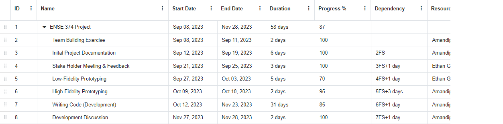

 

# Freight-Joint

## Check out the whole process -> [here](https://binaryqubit.github.io/Freight-Joint/githubPages/index.html)🚚

## Contributors
- [Amandip Padda](https://github.com/BinaryQuBit)
- [Muhammad Tariq](https://github.com/muhammadt1)
- [Ethan Goski](https://github.com/EthanGoski)

## 1) Introduction

In the freight and logistics industry, shippers are entities that need to send goods, and carriers are entities that own vehicles and transport goods. A load board is a marketplace where shippers post their loads, and carriers find and choose loads to transport.

## 2) Design Problem

**2.1)** Problem Definition
In our fast-evolving modern world, built on numerous conveniences and luxuries, the backbone supporting this dynamic lifestyle is the diverse array of global transportation systems. This transportation varies from boats, trains, planes, and most importantly a variety of trucks. These trucks bring our food, packages, building supplies, cars, and much more. However, the trucking industry lacks a well built, biddingless system that connects shippers and carriers. This project aims to fix this issue by creating a website/application that connects shippers and carriers via a loadboard system that allows shippers to post loads without hagling with carriers about the fine details, and allows carriers to choose loads that fit their needs and trucks.

**2.2)** Design Requirements:
* **2.2.1)** Functions: 
    * Our team employed the MERN Stack for our project, which includes MongoDB, ExpressJS, ReactJS, and NodeJS.
    * Interface for Shippers
    * Interface for Drivers
        * Manual-Based matching / assigning system. 
* **2.2.2)** Objectives:
    * The objective of this application is to connect shippers and carriers through a marketplace of loadboard. In a seemless design with ease of use for all parties involved.
* **2.2.3)** Constraints:
    * **Economic Factors:** Access our services free of charge, with only minimal technological requirements needed.
    * **Regulatory Compliance:** Features role-based access control, providing tailored experiences for shippers and drivers. Utilizes Passport for authentication.
    * **Reliability:**  Our application reliably delivers consistent performance, guaranteeing a stable and dependable user experience.
    * **Societal Impact:** Pioneers an innovative approach to enhance logistics services, impacting the industry positively.

## 3) Solution
* **3.1)** **First Solution:** Our first solution was just a simple low fidelity prototype that laid out the general ideas for what we wanted. 
*  **3.2)** **Second Solution:** Our second solution was a high fidelity prototype built on Figma. This built a better base for what we wanted and had some visual features like navigation but nothing too advanced.
*  **3.3)** **Final Solution:** We chose this solution as it gave us the depth we wanted, had a strong base and showed all of the aspects that connected the shippers and carriers together.
*  **3.3.1)** **Components:** We have utilized several forms for Registration and Login, as well as using a loadboard component to create similar loadboards for both shippers and carriers.
*  **3.3.2)** **Features:** Our Solution contains pages for registration,login, loadboards for both shippers and carriers, and finally a manual based matching system that allows for shippers to post loads and carriers to pick up those loads.
*  **3.3.3)** **Environmental, Societal, Safety, and Economic Considerations:**
   *  Our Solution takes the environment into account by limiting the need for in person discussions and we envisioned a geolocation tracker to get the truckers on optimal paths to limit polution.
   *   Societal considerations were that the bidding culture that is currently in place for truckers and shippers is a toxic environment that has some corruption, however, our solution could remove this culture and replace it with one where respect and honesty are revered.
   *   Our solution would improve safety as it would limit potential conflicts due to disagreements as well as limiting potential dangerous situations by the implementation of geolocation tracking.
   *   Economically, our solution would even the playing field by making it so all shippers and carriers have the same ability to acquire loads and are not limited by the extent of their resources.
*  **3.3.4)** Limitations: The Limitations we faced were an inability to do any actual in-field testing, no geolocation tracker,a limited matching system, and a limited knowledge into the inner workings of the trucking industry.

## 4) Teamwork
* [Meeting 1:](https://binaryqubit.github.io/Freight-Joint/githubPages/week1.html)
    * **Time:** 09-08-2023
    * **Agenda**: Ice Breaker

        | Team Member | Previous Task | Completion State  | Next Task|
        |----------|----------|----------|----------|
        | Ethan. G    | N/A     | N/A     | Collaborate with one other.    |
        | Amandip. P    | N/A     | N/A     | Collaborate with one other.    |
        | Muhammad. T| N/A     | N/A     | Collaborate with one other.     |

* [Meeting 2:](https://binaryqubit.github.io/Freight-Joint/githubPages/week2.html)
    * **Time:** 09-15-2023
    * **Agenda**: Brainstorming

        | Team Member | Previous Task | Completion State  | Next Task|
        |----------|----------|----------|----------|
        | Ethan. G    | Ice Breaker    | 100%   | Cost Benefit Analysis  |
        | Amandip. P    |Ice Breaker     | 100%      | Document lookout |
        | Muhammad. T| Ice Breaker    | 100%      | Business Case |

* [Meeting 3:](https://binaryqubit.github.io/Freight-Joint/githubPages/week3.html)
    * **Time:** 09-22-2023
    * **Agenda**: Prototyping Meeting

        | Team Member | Previous Task | Completion State  | Next Task|
        |----------|----------|----------|----------|
        | Ethan. G    | Cost Benefit Analysis   | 100%   | Low-Fidelity Prototyping  |
        | Amandip. P    |Document lookout    | 100%      | Low-Fidelity Prototyping |
        | Muhammad. T|Business Case  | 100%      | Low-Fidelity Prototyping |

* [Meeting 4:](https://binaryqubit.github.io/Freight-Joint/githubPages/week4.html)
    * **Time:** 09-29-2023
    * **Agenda**: Prototyping Meeting

        | Team Member | Previous Task | Completion State  | Next Task|
        |----------|----------|----------|----------|
        | Ethan. G    | Low-Fidelity Prototyping  | 100%   | High-Fidelity Prototyping  |
        | Amandip. P    |Low-Fidelity Prototyping   | 100%      | High-Fidelity Prototyping |
        | Muhammad. T|Low-Fidelity Prototyping     | 100% |High-Fidelity Prototyping |

* [Meeting 5:](https://binaryqubit.github.io/Freight-Joint/githubPages/week5.html)
    * **Time:** 10-06-2023
    * **Agenda**: High-Fidelity Prototyping Meeting

        | Team Member | Previous Task | Completion State  | Next Task|
        |----------|----------|----------|----------|
        | Ethan. G    | High-Fidelity Prototyping  | 100%   | Front-End Development |
        | Amandip. P    |High-Fidelity Prototyping   | 100%      | Front-End Development |
        | Muhammad. T|High-Fidelity Prototyping     | 100% |Front-End Development |

* [Meeting 6:](https://binaryqubit.github.io/Freight-Joint/githubPages/week6.html)
    * **Time:** 2023-10-21
    * **Agenda**: Code Discussion and Review

        | Team Member | Previous Task | Completion State  | Next Task|
        |----------|----------|----------|----------|
        | Ethan. G    | Front-End Development  | 65%  | Front-End Development |
        | Amandip. P    |Front-End Development  | 80%      | Back-End Development |
        | Muhammad. T|Front-End Development    | 70% |Front-End Development & Kanban Initialization |

* [Meeting 7:](https://binaryqubit.github.io/Freight-Joint/githubPages/week10.html)
    * **Time:** 2023-11-19
    * **Agenda**: Insight Meeting 

        | Team Member | Previous Task | Completion State  | Next Task|
        |----------|----------|----------|----------|
        | Ethan. G    | Front-End Development  | 65%  | Front-End Development |
        | Amandip. P    |Front-End Development  | 80%      | Back-End Development |
        | Muhammad. T|Front-End Development    | 70% |Front-End Development & Kanban Initialization |

* [Meeting 8:](https://binaryqubit.github.io/Freight-Joint/githubPages/week11.html)
    * **Time:** 2023-11-27
    * **Agenda**: Last Meeting

        | Team Member | Previous Task | Completion State  | Next Task|
        |----------|----------|----------|----------|
        | Ethan. G    | Front-End Development  |100%  | Finalize Documentation |
        | Amandip. P  |Back-End Development  | 98%      | Finalize Documentation |
        | Muhammad. T|Front-End Development & Kanban Initialization   | 100% |Finalize Documentation|

## 5) Project Management

[GanttPDF](https://binaryqubit.github.io/Freight-Joint/Documents/Week1/Online%20Gantt%2020231127.pdf)

## 6) Conclusion and Future Work
In the end we created a website that allowed shippers and truckers to sign up and login. Shippers can post their loads and see what they have posted. Truckers can match with their desired loads. So all in all, we created a proper loadboard for shippers and truckers, with some ability to match loads. 
However, we were unable to do all of what we wanted as we could not implement a geolocation tracking system and should have had a more in depth matching system that allowed for slightly easier matching.

   In the future we would improve on the solution by adding a rudimentary geolocation tracking system, make a easier matching system and implement features like having a baseline rate implemented for loads. These features would require some research and development but should remain within the limitations of the project and not go beyond the scope of the project.

## Getting Started

### Downloads:
- [Visual Studio Code](https://code.visualstudio.com/download)
- [Node JS Framework (Ver. 18.16.1 LTS) - Tested ✔](https://code.visualstudio.com/download)

### Run app on your localhost:

`Change to required directory`

        code/public

`Install required React scriptS`

        npm install react-scripts --save

`Run on your localhost`

        npm start
